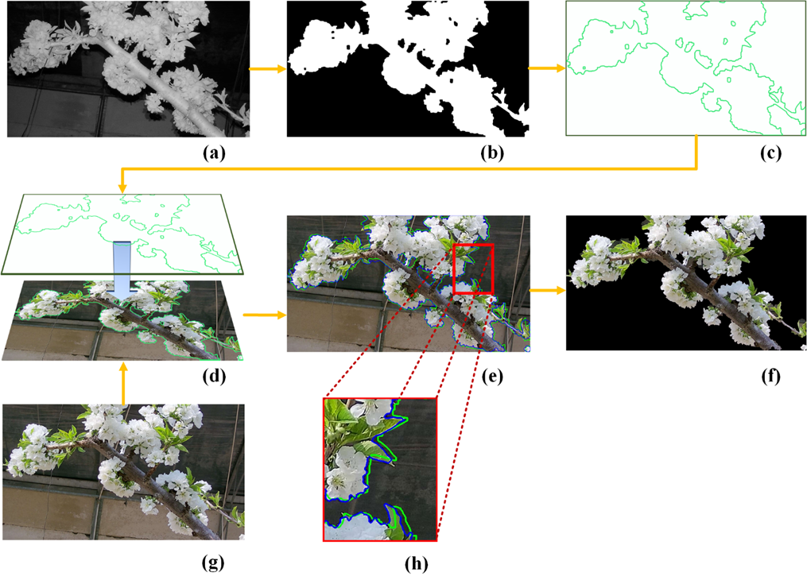
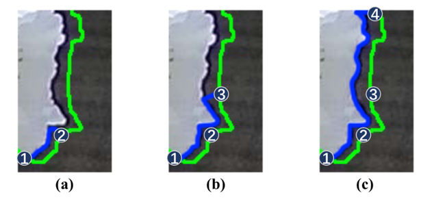
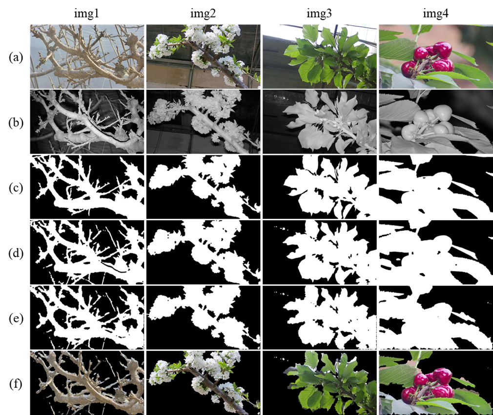

## Asynchronous Overlapping: A image segmentation method for key feature regions of plant phenotypin

# Introduction

Acquiring and describing plant phenotyping is an important proposition in botany and agronomy research. In this study, a computer vision-based asynchronous overlapping segmentation algorithm is proposed for automatic image acquisition of key feature regions of plant phenotyping. Firstly, day-time RGB and night-time grayscale images of infrared light filling the crop body at the same angle are asynchronously obtained using a common closed-circuit television surveillance camera. Then, thresholding and morphological filtering of grayscale images are conducted to extract the initial region contours. With this as a precondition, the algorithm adaptively finds edge paths of key feature regions in daytime RGB images. In the test of the cherry plant image, the intersection over union (IoU) of the algorithm to segment the key feature regions is 0.8497, reaching a similar level of interactive algorithms that require human involvement. The proposed method has low cost, high segmentation accuracy, and strong applicability. The proposed method can independently realize the acquisition of the key feature regions of plant image phenotypes and can be applied to large-scale agricultural production.

## Result

<table class=MsoTableGrid border=1 cellspacing=0 cellpadding=0 width="81%"
 style='width:81.76%;border-collapse:collapse;border:none;mso-border-alt:solid windowtext .5pt;
 mso-yfti-tbllook:1184;mso-padding-alt:0cm 5.4pt 0cm 5.4pt'>
 <tr style='mso-yfti-irow:0;mso-yfti-firstrow:yes;height:14.0pt'>
  <td width="80%" nowrap colspan=4 style='width:80.36%;border:solid windowtext 1.0pt;
  mso-border-alt:solid windowtext .5pt;padding:0cm 5.4pt 0cm 5.4pt;height:14.0pt'>
  
Classical
  methods<o:p></o:p>

  </td>
  <td width="19%" rowspan=3 style='width:19.64%;border:solid windowtext 1.0pt;
  border-left:none;mso-border-left-alt:solid windowtext .5pt;mso-border-alt:
  solid windowtext .5pt;padding:0cm 5.4pt 0cm 5.4pt;height:14.0pt'>
  
Asynchronous
  Overlapping<o:p></o:p>

  </td>
 </tr>
 <tr style='mso-yfti-irow:1;height:14.0pt'>
  <td width="40%" nowrap colspan=2 style='width:40.18%;border:solid windowtext 1.0pt;
  border-top:none;mso-border-top-alt:solid windowtext .5pt;mso-border-alt:solid windowtext .5pt;
  padding:0cm 5.4pt 0cm 5.4pt;height:14.0pt'>
  
Automatic
  algorithms<o:p></o:p>

  </td>
  <td width="40%" nowrap colspan=2 style='width:40.18%;border-top:none;
  border-left:none;border-bottom:solid windowtext 1.0pt;border-right:solid windowtext 1.0pt;
  mso-border-top-alt:solid windowtext .5pt;mso-border-left-alt:solid windowtext .5pt;
  mso-border-alt:solid windowtext .5pt;padding:0cm 5.4pt 0cm 5.4pt;height:14.0pt'>
  
Interactive
  algorithms<o:p></o:p>

  </td>
 </tr>
 <tr style='mso-yfti-irow:2;height:14.0pt'>
  <td width="20%" nowrap valign=top style='width:20.08%;border:solid windowtext 1.0pt;
  border-top:none;mso-border-top-alt:solid windowtext .5pt;mso-border-alt:solid windowtext .5pt;
  padding:0cm 5.4pt 0cm 5.4pt;height:14.0pt'>
  
Ostu<o:p></o:p>

  </td>
  <td width="20%" nowrap valign=top style='width:20.1%;border-top:none;
  border-left:none;border-bottom:solid windowtext 1.0pt;border-right:solid windowtext 1.0pt;
  mso-border-top-alt:solid windowtext .5pt;mso-border-left-alt:solid windowtext .5pt;
  mso-border-alt:solid windowtext .5pt;padding:0cm 5.4pt 0cm 5.4pt;height:14.0pt'>
  
ExG-ExR<o:p></o:p>

  </td>
  <td width="20%" nowrap valign=top style='width:20.08%;border-top:none;
  border-left:none;border-bottom:solid windowtext 1.0pt;border-right:solid windowtext 1.0pt;
  mso-border-top-alt:solid windowtext .5pt;mso-border-left-alt:solid windowtext .5pt;
  mso-border-alt:solid windowtext .5pt;padding:0cm 5.4pt 0cm 5.4pt;height:14.0pt'>
  
GrabCut<o:p></o:p>

  </td>
  <td width="20%" nowrap valign=top style='width:20.1%;border-top:none;
  border-left:none;border-bottom:solid windowtext 1.0pt;border-right:solid windowtext 1.0pt;
  mso-border-top-alt:solid windowtext .5pt;mso-border-left-alt:solid windowtext .5pt;
  mso-border-alt:solid windowtext .5pt;padding:0cm 5.4pt 0cm 5.4pt;height:14.0pt'>
  
Original
  intelligent scissors<o:p></o:p>

  </td>
 </tr>
 <tr style='mso-yfti-irow:3;mso-yfti-lastrow:yes;height:14.0pt'>
  <td width="20%" nowrap valign=top style='width:20.08%;border:solid windowtext 1.0pt;
  border-top:none;mso-border-top-alt:solid windowtext .5pt;mso-border-alt:solid windowtext .5pt;
  padding:0cm 5.4pt 0cm 5.4pt;height:14.0pt'>
  
0.3826
  <o:p></o:p>

  </td>
  <td width="20%" nowrap valign=top style='width:20.1%;border-top:none;
  border-left:none;border-bottom:solid windowtext 1.0pt;border-right:solid windowtext 1.0pt;
  mso-border-top-alt:solid windowtext .5pt;mso-border-left-alt:solid windowtext .5pt;
  mso-border-alt:solid windowtext .5pt;padding:0cm 5.4pt 0cm 5.4pt;height:14.0pt'>
  
0.3346
  <o:p></o:p>

  </td>
  <td width="20%" nowrap valign=top style='width:20.08%;border-top:none;
  border-left:none;border-bottom:solid windowtext 1.0pt;border-right:solid windowtext 1.0pt;
  mso-border-top-alt:solid windowtext .5pt;mso-border-left-alt:solid windowtext .5pt;
  mso-border-alt:solid windowtext .5pt;padding:0cm 5.4pt 0cm 5.4pt;height:14.0pt'>
  
0.7533
  <o:p></o:p>

  </td>
  <td width="20%" nowrap valign=top style='width:20.1%;border-top:none;
  border-left:none;border-bottom:solid windowtext 1.0pt;border-right:solid windowtext 1.0pt;
  mso-border-top-alt:solid windowtext .5pt;mso-border-left-alt:solid windowtext .5pt;
  mso-border-alt:solid windowtext .5pt;padding:0cm 5.4pt 0cm 5.4pt;height:14.0pt'>
  
0.8508
  <o:p></o:p>

  </td>
  <td width="19%" nowrap valign=top style='width:19.64%;border-top:none;
  border-left:none;border-bottom:solid windowtext 1.0pt;border-right:solid windowtext 1.0pt;
  mso-border-top-alt:solid windowtext .5pt;mso-border-left-alt:solid windowtext .5pt;
  mso-border-alt:solid windowtext .5pt;padding:0cm 5.4pt 0cm 5.4pt;height:14.0pt'>
  
0.8497
  <o:p></o:p>

  </td>
 </tr>
</table>